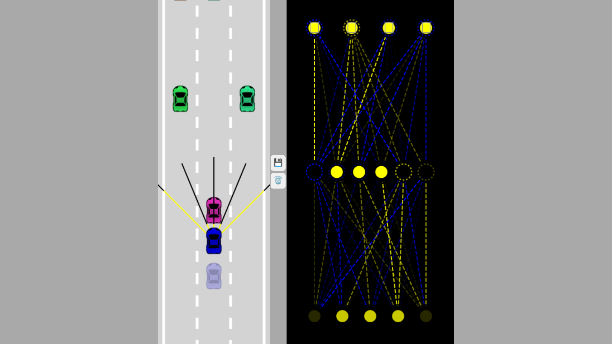
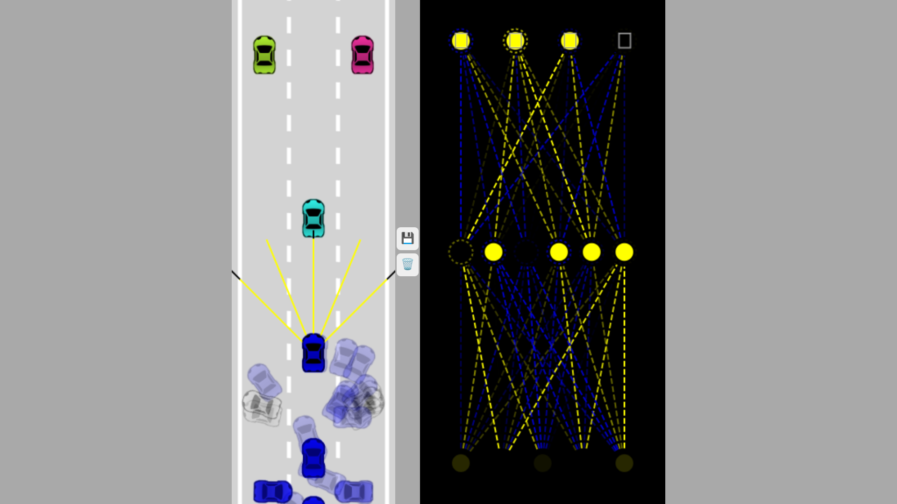

# Overview:
This project aims to develop a self-driving car system using a neural network built entirely from scratch, without relying on any external libraries. The neural network is trained and fine-tuned to recognize and respond to various driving scenarios. Additionally, a real-time visualization of the neural network's operations is provided using Canvas, offering insights into its decision-making process.

## Demo:
Click Here: <a href="https://zaineli.github.io/Self-Driving-Car/" alt="Link">View Live</a>

<video src="Untitled%20design.mp4" controls title="Title"></video>

## Features:
### 1. Neural Network from Scratch: 
The neural network architecture, including layers, activation functions, and optimization algorithms, is implemented without utilizing any pre-existing libraries.

### 2. Self-Driving Car Simulation: 
A simulated environment is created where the self-driving car navigates through various scenarios, such as detecting obstacles, following lanes, and making decisions at intersections.

### 3. Real-Time Visualization:
The inner workings of the neural network are visualized using Canvas, providing a live demonstration of its decision-making process as the car operates in the simulated environment.
## Contributing
Contributions to the project, including bug fixes, enhancements, and new features, are welcome. Please fork the repository, make your changes, and submit a pull request with a clear description of the proposed changes.
